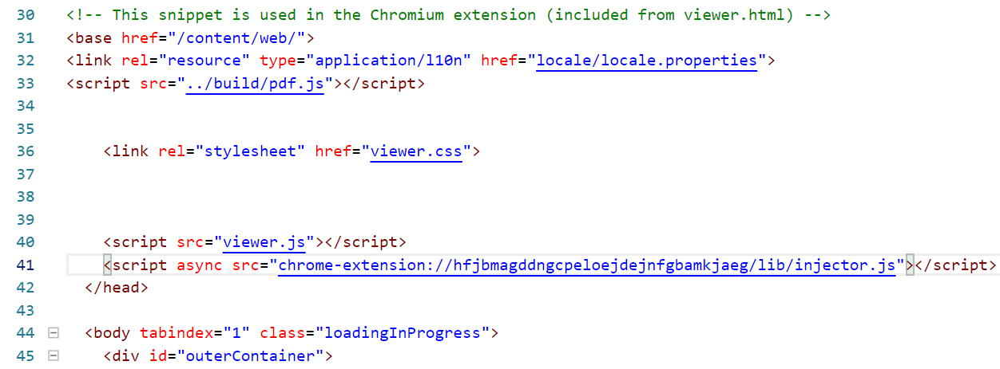
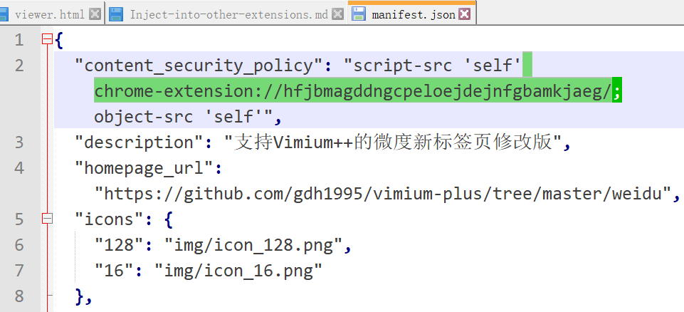

(This page is only for advanced users)

Vimium C is carefully designed and provides a convenient injector to run onto pages of another extension,
as soon as the extension declares that itself has Vimium C supports.

So here's a tutorial about how to create such an extension
(e.g. the official [PDF Viewer](https://chrome.google.com/webstore/detail/pdf-viewer/oemmndcbldboiebfnladdacbdfmadadm)).

## Necessary conditions

This trick only works when a target extension has a format of `Manifest V2`, but not `Manifest V3`,
unless https://bugs.chromium.org/p/chromium/issues/detail?id=1282890 gets fixed.

Related document of `Manifest V3`:
    https://developer.chrome.com/docs/extensions/mv3/intro/mv3-migration/#content-security-policy .

## Prepare sources
1. Install Vimium C and PDF Viewer on your browser
2. Go to Chrome's `User Data` folder,
  which may be "`C:\Users\<your username>\AppData\Local\Google\Chrome\User Data`" on Windows
3. search the folder "Default" for a folder named "oemmndcbldboiebfnladdacbdfmadadm",
  copy it's subfolder (e.g. named "2.0.673_0") to somewhere others for further work

## Modify HTML pages of the extension
1. search the folder for `.html` and `.html` files (e.g. `content/web/viewer.html`)
2. and open them using a good text editor / IDE (like Notepad++ and Visual Studio Code)
3. find "`</head>`", and if the text doesn't exist, find "`</body>`" or even "`</html>`"
4. insert a line of
  `<script type="text/javascript" src="chrome-extension://hfjbmagddngcpeloejdejnfgbamkjaeg/lib/injector.js"></script>`
  before the found position
  * if Vimium C has a different ID (the options page is not
      chrome-extension://hfjbmagddngcpeloejdejnfgbamkjaeg/pages/options.html)
    * for example, the ID of Vimium C on Microsoft Edge Add-Ons is `aibcglbfblnogfjhbcmmpobjhnomhcdo`
  * you will need to modify the URL above and replace the URL's
    [origin](https://developer.mozilla.org/en-US/docs/Web/API/HTMLHyperlinkElementUtils/origin) part.
5. repeat the step above on all HTML files, and save all changes

## Modify extension properties (only required on Chrome)
1. open `manifest.json` using your text editor
2. find the line containing "`content_security_policy`",
  and insert "` chrome-extension://hfjbmagddngcpeloejdejnfgbamkjaeg/`" (note the beginning space character)
  between "`script-src ...`" and the next "`;`"
3. if there's no such a line containing "`content_security_policy`",
  then just insert a line of
  `"content_security_policy": "script-src 'self' chrome-extension://hfjbmagddngcpeloejdejnfgbamkjaeg/; object-src 'self'",`
  after the first "`{`" character
4. the CSP rule above is required since Chrome 56, or external scripts wouldn't run on injected extensions
5. delete a line looking like `"key": "...",` (to avoid ID conflicts with the original extension)
6. save `manifest.json`
7. delete the folder `_metadata` because now the modified project can't pass Chrome's file content verification

## Load the modified extension and enable injection
1. open `chrome://extension`, and click the switcher of "`Developer mode`" (in Chinese, it's "开发者模式")
2. click the newly visible button "`Load unpacked extension...`" and choose the work folder to load it as an extension
3. now Chrome will assign a new unique ID for the new extension, which is shown on chrome://extension,
  and remember it (e.g. "`nacjakoppgmdcpemlfnfegmlhipddanj`")
4. go to the Vimium C Options page, **in advanced options add the ID into the "White list of other extension IDs"**,
  and then save changes
5. open pages of the new extension and now Vimium C should work perfectly.
6. if the modified extension is PDF Viewer, then just open a PDF file and Vimium C will be able to mark most buttons

### Make loaded temporary web-extension persistent on Firefox

Firefox will auto drop temporary extensions on a new start, and it's very annoying.

Here's a way to make Firefox stop this behavior:
1. you must use a dev/nightly version of Firefox, but not the stable ones
2. go to `about:config` and ensure `xpinstall.signatures.required` is `false`

## Useful switches of injection

You may add some configuration as `[data-*]` attributes into `<script src="***/injector.js></script>`:
1. `[data-block-focus]` means to grab back focus on a page loading
  - if no such a attribute, Vimium C won't grab focus,
    even though `Don't let pages steal the focus in loading` is enabled
  - `[data-block-focus]` can be empty, `true`, or `false` (which means not to grab)
2. `[data-vimium-hooks=false]` means to not hook `addEventListener`
  - the hook to `addEventListener` might break some JS frameworks,
    so a `false` will turn off the feature to keep original code work perfectly

## Notes for Firefox

Firefox generates a different UUID for the same extension everytime you install it,
  making the URL of "injector.js" is uncertain.
Therefore, Vimium C puts its UUID into the response for message "99" on Firefox since version 1.74.

Users may try this script by saving it into a file like `<extension-root>/injector.js` and add its link into HTML:

``` javascript
"use strict";
(async () => {
  const browser_ = globalThis.browser && browser.runtime ? browser : chrome
  const loadJS = (host) => {
    const injector = location.protocol + `//${host}/lib/injector.js`;
    const script = document.createElement('script');
    script.src = injector;
    return document.head.appendChild(script);
  };
  const queryVimiumC = () => {
    return browser_.runtime.sendMessage('vimium-c@gdh1995.cn', { handler: 99 })
  };
  const knownHost = localStorage.vimiumCHost;
  if (knownHost) {
    const element = loadJS(knownHost)
    try {
      await new Promise((resolve, reject) => {
        element.onload = () => { resolve(); element.remove() }
        element.onerror = () => { reject(); element.remove() }
      })
      return
    } catch { }
    // maybe UUID changed
  }
  queryVimiumC().catch((err) => {
    if ((err + "").includes("Receiving end does not exist")) {
      return new Promise(resolve => {
        setTimeout(() => {
          resolve(queryVimiumC().catch((err2) => {
            console.log("can not load vimium c: 2nd:", err2)
          }))
        }, 100)
      })
    } else {
      console.log("can not load vimium c:", err)
    }
  }).then((res) => {
    if (!res) {
      return;
    }
    const { host } = res;
    console.log("vimium c host:", host); // for example, log "d1ba02e9-ec90-46dc-8623-69e15961cc86"
    localStorage.vimiumCHost = host; // cache it for further usages
    loadJS(host);
  });
})();
```

## Some comments

The key changes are:
  **`<script>` in HTML files**,
  **changing CSP** and removing `"key":` line in `manifest.json`,
  and add **wanted extension IDs into Vimium C's white list** for injection.

Usually Vimium C works perfectly on extension environments, but if any bug or crash is found,
please file an issue on https://github.com/gdh1995/vimium-c/issues . Thanks for your help.

For example, a modified `viewer.html` from PDF Viewer looks like:


And a modified `manifest.json` from X New Tab looks like:

