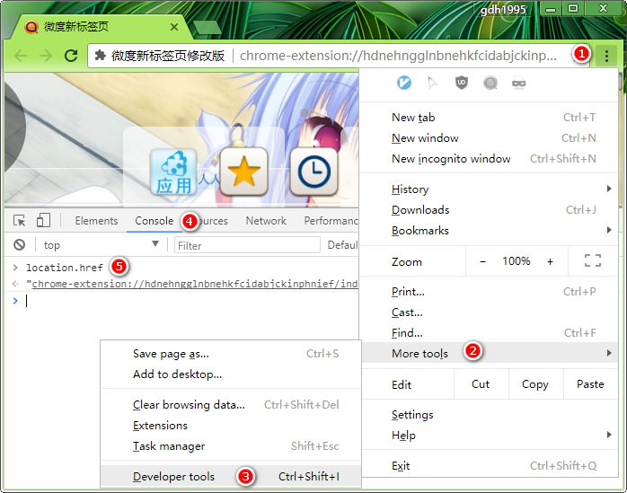

Vimium C can not read a browser's new-tab configuration directly, so its `createTab` command uses the value of its "New tab URL" option to open new tabs.

By default, the option is set to `about:newtab` (or `chrome://newtab` on Chrome), and then `createTab` tells your browser to open a "browser-level" new-tab. Maybe you used to see browser focuses on its address bar in the same time, but if you want to keep the focus on a web page itself, then Vimium C is just enough - by setting its "New tab URL" option to an inner URL of another new-tab extension.

Here's the steps (on Chrome):

1. open `chrome://extensions`, and ensure your preferred new-tab extension is enabled.
2. open a new tab through your browser's built-in shortcut (`Ctrl+T` or click the "plus" button in the browser tab bar)
3. click the browser menu button, go to "More tools", and click and open "Developer Tools"
4. click the "Console" tab panel, input `location.href`
5. you'll get a URL of `chrome-extension://<extension-id>/...` (e.g. "chrome-extension://hdnehngglnbnehkfcidabjckinphnief/index.html"), and copy it
6. make Vimium C enabled and open its options page
6. paste the URL into the input area of "New tab URL" option, and save changes.

